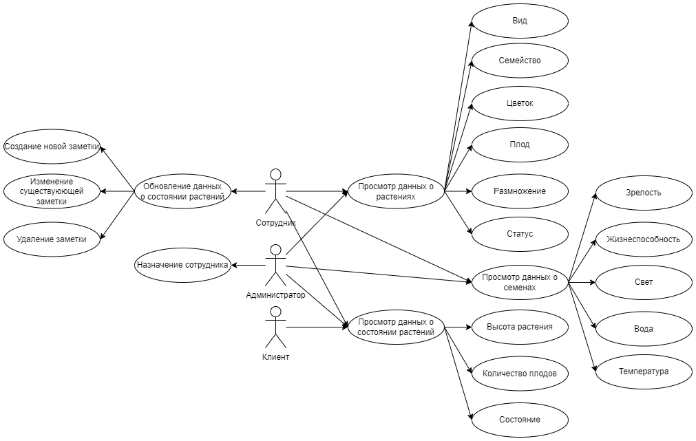
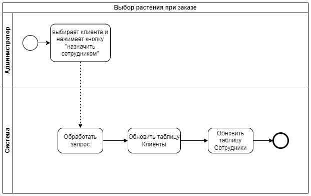
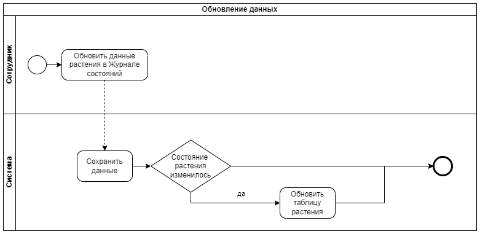
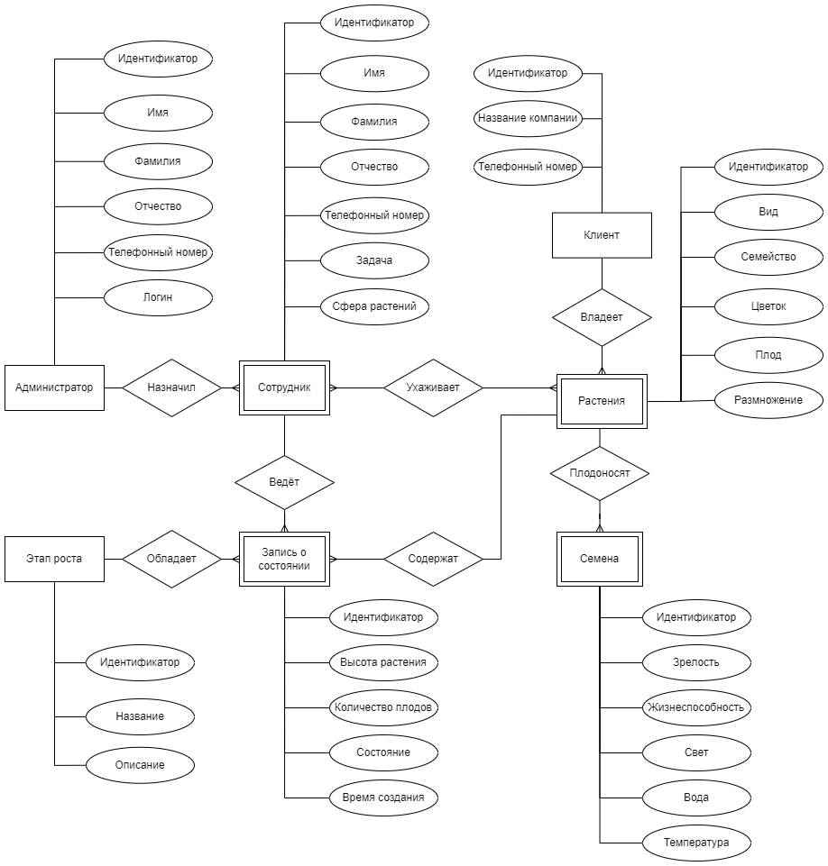
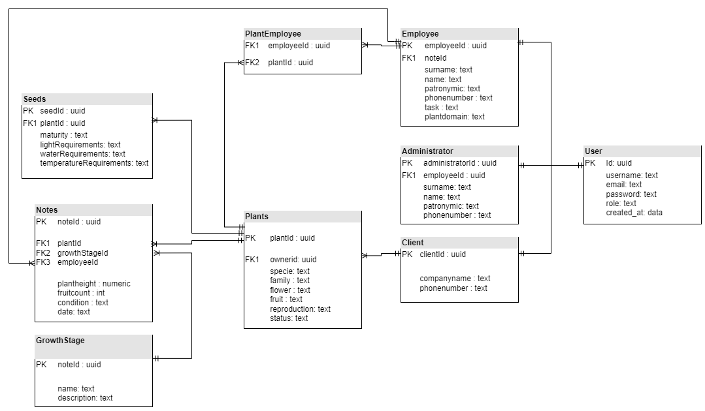
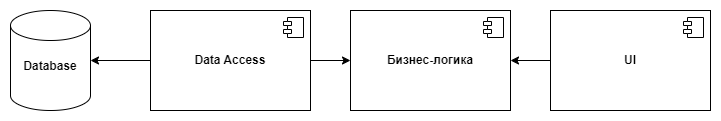
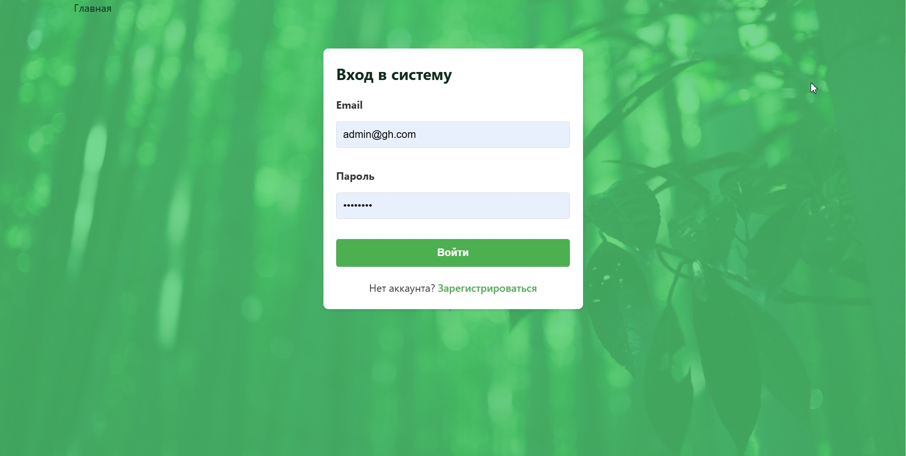
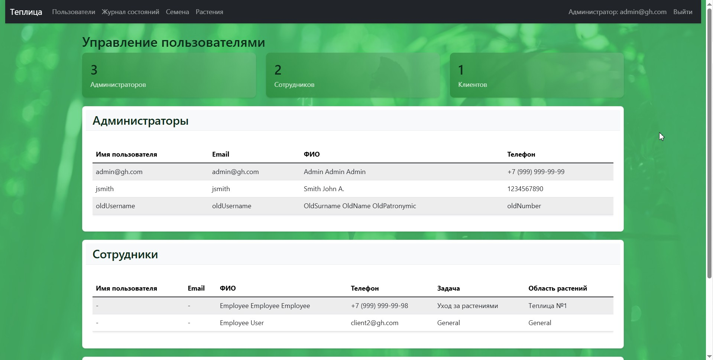
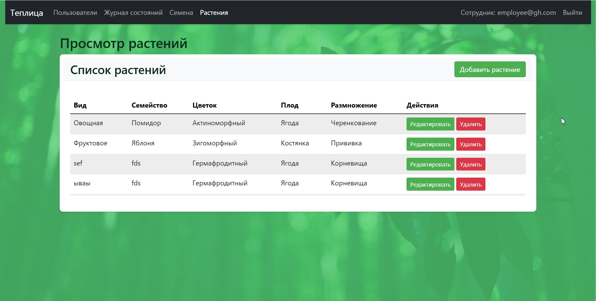
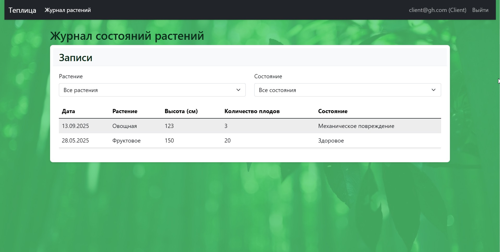

# Лабораторная 1

## 1. Цель работы, решаемая проблема/предоставляемая возможность
1. **Цель работы**: разработка веб-приложения для автоматизации управления теплицей, обеспечивающего учёт и контроль за растениями, сотрудниками и клиентами.

2. **Решаемая проблема**: современные теплицы сталкиваются с неэффективным ручным управлением данными: ведением журналов состояний растений на бумажных носителях, отсутствием оперативного доступа к произошедшим изменениям, сложностями во взаимодействии между администрацией, сотрудниками и клиентами.

3. **Предоставляемая возможность**: система предоставляет возможность автоматизации процессов ухода за растениями и фиксации их состояния, возможности для клиентов в реальном времени отслеживать статус заказанных растений и обеспечение простого наблюдения администраторов и сотрудников за работниками и клиентами теплицы.

## 2. Краткий перечень функциональных требований
1. Управление учётными записями и ролями.
2. Управление каталогом растений.
3. Ведение журнала состояний растений.
4. Управление задачами для сотрудников.
5. Клиентский функционал (просмотр статуса заказанных растений через журнал состояний).

## 3. Use-case диаграмма системы

## 4. BPMN диаграмма основных бизнес-процессов

## 5. Примеры описания основных пользовательских сценариев
### Сценарий 1: Фиксация состояния растения сотрудником
- Сотрудник авторизован в системе.
    - Сотрудник переходит в раздел "Журнал состояний".
    - Нажимает кнопку "Добавить запись".
    - Выбирает из списка растение "Сакура".
    - Заполняет форму: высота растения, количество плодов, состояние.
    - Нажимает "Сохранить".
- В системе создана новая запись в журнале состояний, привязанная к растению. Администратор видит запись в общем журнале.

### Сценарий 2: Назначение администратором клиента сотрудником
- Администратор авторизован в системе.
    - Администратор переходит в раздел "Сотрудники".
    - Выбирает сотрудника "Савельева Анастасия Геннадиевна".
    - Нажимает "Назначить".
- Клиент Савельева Анастасия Геннадиевна становится сотрудником.

### Сценарий 3: Отслеживание заказа клиентом
- Клиент авторизован в системе. У клиента есть активный заказ на выращивание пальмы и баобаб.
    - Клиент переходит на страницу "Журнал состояний".
    - Выбирает с помощью фильтра растение "пальма".
- Система отображает таблицу с датами и параметрами пальмы за все время. Клиент не видит данные других клиентов и других своих заказов.

## 6. ER-диаграмма сущностей

## 7. Технологический стек

- Backend: C#
- Frontend: Angular, TypeScript
- База данных: PostgreSQL

## 8. Диаграмма БД

## 9. Компонентная диаграмма системы

## 10. Экраны будущего web-приложения

[//]: # (dotnet run --project src/Server/Server.csproj)
./start-servers.ps1
http://localhost:5097/login.html

# Запуск серверов
npm run servers
# Запуск тестов
npm test
npm run test:unit
npm run test:e2e

Администратор:
Логин: admin@gh.com
Пароль: admin123
Сотрудник:
Логин: employee@gh.com
Пароль: employee123
Клиент:
Логин: client@gh.com
Пароль: client123